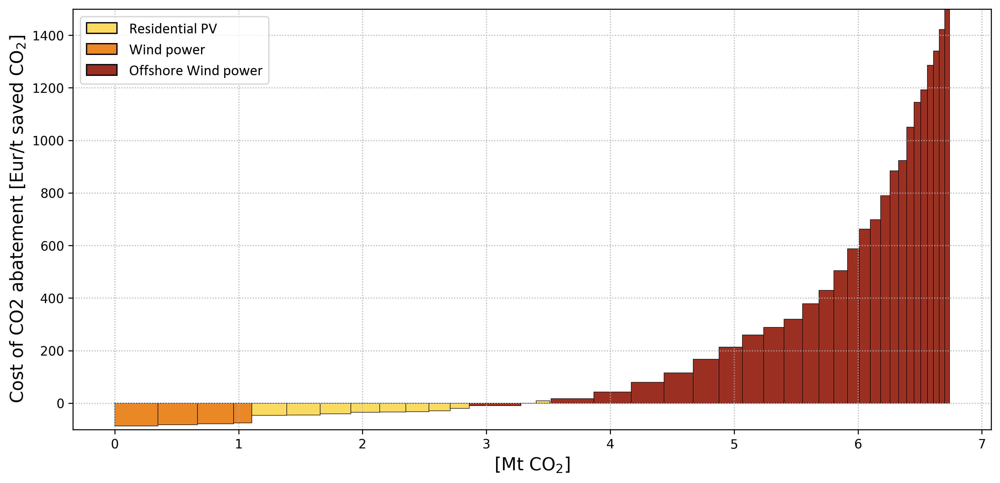

# EPLANoptMAC #
EPLANopt is a powerful energy system optimization model based on the EnergyPLAN software developed by Aalborg University. This model is specifically designed to inspect and identify the best future alternatives for the energy system by considering the challenges of the energy transition. This repository contains the EPLANopt model and its associated files. 

## Requirements ##
- EnergyPLAN version >=15.1 (to download the software developed by [Aalborg University](https://www.en.plan.aau.dk/) go to [EnergyPLAN website](https://www.energyplan.eu/))

## Features ##
- High temporal resolution for accurately capturing renewable energy variability.
- Sector-coupling to evaluate synergies between energy sectors.
- Multi-objective optimization approach for transparent decision-making.
- Partnering with Eurac Research for model development and application.

## Key Components ##
Future best energy mixes
Evaluation of costs for current and future energy systems
Analysis of the structure of the energy system cost
Hourly energy flows and exchanges analysis
Must-haves and must-avoids for decarbonization measures

## Solution Advantages ##
Integrated: Considers all energy sectors (power, heating, cooling, transport, and industry) in an integrated approach.
High resolution: Properly evaluates the intermittency of renewable energy sources.
Transparent: Provides the Pareto front of optimal techno-economic solutions for policy makers.
Must-have and must-avoids: Identifies common and missing elements of optimal scenarios.
Demonstrated: Applied to various case studies at different scales and locations.

## How to reproduce the example ##
The example presented in this repository is based on the Scenario DK2020_2018edition_cost update.txt provided with the download of the EnergyPLAN software. This file is saved in the input_folder together its ANSI version. To produce the ANSI version needed by the code, you just need to follow these simple instructions: i) Open the DK2020_2018edition_cost update.txt file, ii) File, Save as..., iii) on the bottom change the encoding from Unicode to ANSI, iv) change the name of the file in order to remember that it is the ANSI version and click on Save. This is just to let you know the steps you have to go through if you want to change the EnergyPLAN input file. In the folder you can already find the ANSI version for the considered example: DK2020_2018edition_cost update_ANSI.txt

It is now possible to run the main.py file. in the libeplan.py file there are all the functions used to write input, execute EnergyPLAN and read output.
Once the simulation is finished (consider a number of simulations of energyPLAN equal to **Number of decision variables x Number of steps**, each simulation of EnergyPLAN can take 1-10 seconds depending on your machine). 

## Results ##
Once the simulation is finished the MAC.xlsx is produced. It has 4 sheets:
a) **MAC**. This sheet contains the winning decision variables for each step and all the info to plot the MAC curve.
b) **Cost effectiveness trends**. This sheet contains the values of the Cost effectiveness or Cost of CO2 Abatement (CCA) of each of the decision variables at each step. 
c) **CO2 trends**. This sheet contains the potential abatement of the decision variables at each step.
d) **Output trends**. This sheet contains the outputs of the solution implementing the winning decision variable. the outputs are defined in the Input.xlsx file and described in 3).

By running the MAC_plot.py file is possible to obtain the following plot (MAC.png):

It needs to be mention that this example it's just to show the results that it is possible to obtain with this methodology. The results in the above graph are consequence of the costs implemented in DK2020_2018edition_cost update.txt that have not been modified or checked. 

## How to cite EPLANoptMAC ##
If you use **EPLANoptMAC** for your research, we would appreciate it if you would cite the following papers:
* Prina MG, Fornaroli FC, Moser D, Manzolini G, Sparber W. Optimization method to obtain marginal abatement cost-curve through EnergyPLAN software. Smart Energy 2021:100002. doi:10.1016/j.segy.2021.100002. https://www.sciencedirect.com/science/article/pii/S2666955221000022?via%3Dihub

To directly cite the code please refer to:

## Acknowledgements ##
- Aalborg University for developing the EnergyPLAN software.
- Eurac Research for coupling EnergyPLAN with a multi-objective evolutionary algorithm and applying the EPLANopt model to various case studies.
For any questions or concerns, please visit our Eurac Research website https://www.eurac.edu/it/people/matteo-giacomo-prina.
